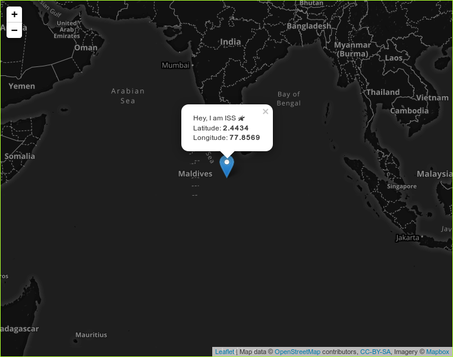

# The EventSource API

<!-- Table containing a few important links -->
<table>
    <tr>
        <td><h3><a href="https://the-eventsource-demo-lacfhxlpdm.now.sh/">Show me the demo</a></h3></td>
        <td><h3><a href="https://html.spec.whatwg.org/multipage/server-sent-events.html">Read the Spec</a></h3></td>
        <td><h3><a href="https://developer.mozilla.org/en-US/docs/Web/API/Server-sent_events/Using_server-sent_events">Read <b>MDN</b> Article on Server Sent Events</a></h3></td>
    </tr>
</table>
<!-- End table -->

## My Goodbye Demo for EventSource Application

### My thoughts behind this application

EventSource was in the browsers even as far as 2010 but I heard about it recently, 
and seeing the age of API and it's interface, I wanted to give it a last good bye 
from my side, so I don't regret in the future about not playing with this simple API (back in the ol' days).

With this in mind I set out to build a simple demo with server pushing the data to client
in realtime. I first started to build Realtime Bitcoin Price site, but seeing that there are already a bajillion sites doing something similar, tracking the location of ISS went out to be a better option, also I was able to create a simple map using LeafletJS which turned out to be really fun. Here's more information about the code.

### About the Code

The code for this demo consists of a simple application built with the help of Express framework. The backend for this code establishes a realtime communication between the application

## Contributing

Contributions are more than welcome, please check out **Issues** for some of the tasks
that can be improved upon.

## License

The source code for the demo is licensed under MIT LICENSE. See [LICENSE](LICENSE)
for more details.